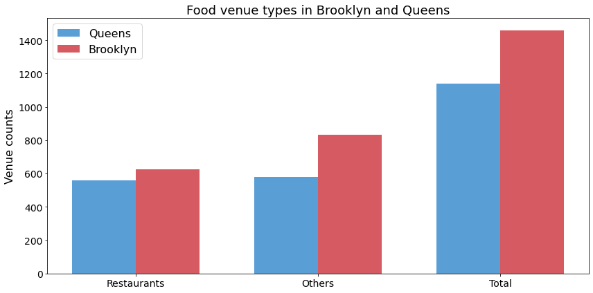

# Capstone Project

## **Brooklyn vs Queens: A Quantitative comparison for new residents**

Having a job in New York City (NYC) and particularly in Manhattan area is
one of the greatest experiences in life and a huge step in one's 
business career as well. Yet, living in a highly populated business center 
as Manhattan is a huge struggle for many of its residents by means of quite 
high rental prices, scarcity in parking places and many other elements of the 
city. This is why two boroughs of NYC, namely Brooklyn and Queens are gaining
popularity as alternative residential areas among newcomers to NYC.[1],[3]

There are many magazine articles about the comparison of these two boroughs 
for the movers. According to these articles Queens and Brooklyn both offer 
relatively lower rental prices and efficient enough transportation to Manhattan. 
They are also wll known to have highly diverse multicultural environments, 
providing their residents spectacular views of the iconic skyline of NYC, and a 
colorful social life with dining places and nightlife. [1],[2]

Although summaries of essential features of Queens and Brooklyn and reports 
pointing out their qualitative similarities are very common, a quantitative 
comparison of these boroughs is not easy to find. Therefore, I would like to 
provide a relatively straightforward quantitative comparison of Brooklyn and 
Queens. To keep it simple, I will essentially analyze food, arts & entertainment,
and college & university venues. 

[1] https://metropolismoving.com/blog/brooklyn-vs-queens/

[2] https://www.pods.com/blog/2019/03/nyc-moving-guide-the-new-york-city-boroughs-explained/

[3] https://ny.curbed.com/2019/1/29/18200093/move-to-new-york-city-guide-advice

## **Data and Usage**

### Section 1) Analysis of Food Venues

- Food is what we need for living. We prefer some tastes to others, so what we choose 
to eat tells a lot about our social identity. Therefore, by the analysis of food venues
I intend to infer about; 

    1. **Diversity among residents:** Although in multicultural societies, people tend
    to taste various cousins, essential demand for a particular cousin is originated
    from the people who borned at the birth place of the cousin. For example, Chinese
    food may be tasty and interesting to try for a European descendant, but eventually the
    diet of this person is mostly from European food. In other words, I believe I can
    tell about residents' origins in Queens and Brooklyn by analysing frequencies of
    cousins in corresponding areas.
    
    2. **Pace of life:** Fast food is a mark in diet for highly mobile and fast pace
    societies. Likewise, the ratio of number of restaurants to the other food locations
    such as food carts or pizza places, is an indicator of the community's life pace.
    As a result, I believe I can infer about relative pace in Brooklyn and Queens by 
    comparing type of food venues in both areas.
    
### Section 2) Analysis of Arts and Entartainment Venues

- Next comparison will be among venues categorized under 'Art and Entartainment' section 
of foursquare data. By analyzing the venues data, I intend to infer about availability 
of social gatherings which will be a measure of strength of social interactions within 
communities of each boroughs.

- Lastly, I would like to compare two boroughs with respect to 'Collage and 
University' venues. Comparison of higher education venues will be a measure of the
average education levels and so may correlate with the acceptance of a newcomer within
the resident community.

## **Data Analysis Results**
Brooklyn and Queens are two well-known neighbors of NYC. (Fig 1). Because of their
proximity I assume traveling to NYC is very similar from any of these boroghs by
public transportation. I also assume populations of each area is not dramatically
different. With these said all data analysis code is stored in the following Jupyter
Notebook;

https://github.com/pekermilas/Coursera_Capstone/blob/master/Capstone_Project_TheBattleOfNeighborhoods/BrooklyVsQueens.ipynb

* Fig 1. Geographical locations of Brooklyn neighborhoods (blue circles) and 
Queens neighborhoods (red circles).*

### Analysis of Food Venues
1. Both Brooklyn and Queens offer variety of cousins by various
restaurant types. (Fig 2 and Fig 3)
2. Most common cousins in Brooklyn European and South American originated, while
in Queens the dominant cousins are more from Asia. (Fig 2)
3. Number of restaurants are slightly higher in Brooklyn than Queens (about 200). (Fig 3)
4. In Queens, number of restaurants are very close to the number of non-restaurant
type food venues (pizza places, food carts, etc.). (Fig 3)
5. In Brooklyn, there are more non-restaurant type food venues than restaurants. (Fig 3)

* Fig 2. Most common restaurants by their cousins found in Brooklyn
and in Queens.*

* Fig 3. Comparison of types of food venues found in Brooklyn and Queens.*

### Analysis of Arts & Entertainment Venues
1. Number of Arts and Entertainment venues are much higher in Brooklyn than Queens (106 vs 30). (Fig 4)
2. While Brooklyn is offering a variety of classic arts based venues such as art galleries
and concert halls, Queens is mostly offering social gathering places for entertainment such
as bowling alleys and performing arts venues. (Fig 4)

* Fig 4. Comparison of Arts and Entertainment venues found in Brooklyn and Queens.*

### Analysis of Higher Education Venues
1. Number of Education venues in Brooklyn are much highre the number in Queens (54 vs 21). (Fig 5)
2. Most of the Higher Education venues in Brooklyn are affliated either with a university
or with a college while ones in Queens half of the venues are not affliated with any 
university of college. (Fig 5)

* Fig 5. Comparison of Higher Education venues found in Brooklyn and Queens.*

## **Interpretation of Results and Discussion**

According to analysis of food venues, I may infer following features of communities living
in Brooklyn and Queens;

- Both Brooklyn and Queens offer multicultural communities to newcomers.
- It seems like more of Brooklyn's residents are either European or American descendants. Queens'
community on the other hand, is consisting more of Asian originated people.
- In Queens, number of restaurants and other food venues are pretty similar. In Brooklyn, other
food venues such as (pizza places, food carts, etc.) are more than restaurants. That may mean
Brooklyn is a relatively fast paced area compared to Queens. It may also mean, business areas
in Brooklyn is growing so the demand to fast food.

According to analysis of arts and entertainment venues, I may infer following features of communities living
in Brooklyn and Queens;

- Brooklyn is more of a art and entertainment area and offers a large variety of social
gathering opportunities compared to Queens.
- It is likely that the average income of community in Queens is lower than Brooklyn, so
type of venues there are more on the entertainment and informal social gathering sides.

According to analysis of higher education venues, I may infer following features of communities living
in Brooklyn and Queens;

- Although both Brooklyn and Queens offer higher education opportunities to their community
locally. Education envirenment is more develop and richer in Brooklyn in terms of the number of
venues associated with higher education. 
- It is hard to make a comment on the local education levels of two communities because of
highly developed transportation network which allows individuals to get mobilized and receive
education at nearby areas. Yet having local institutions may indicate that in Brooklyn just by
the affliated people to these institutions, average education level in society is slightly 
higher.

